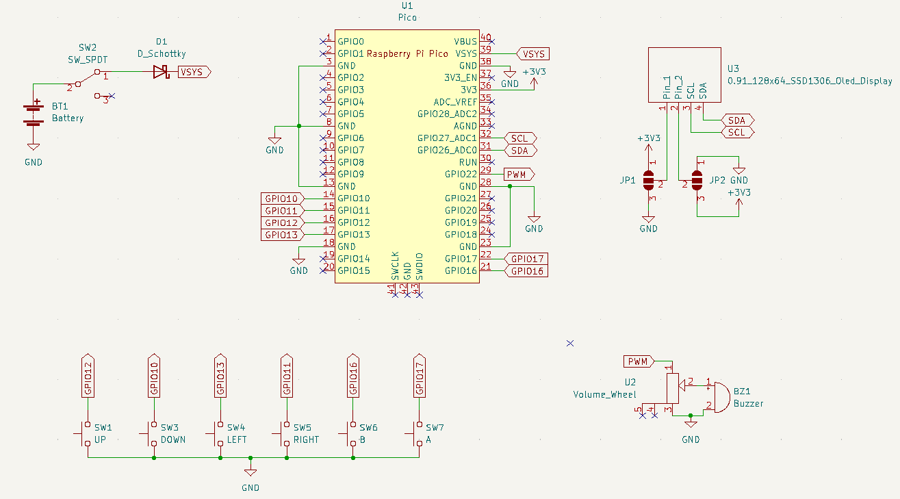
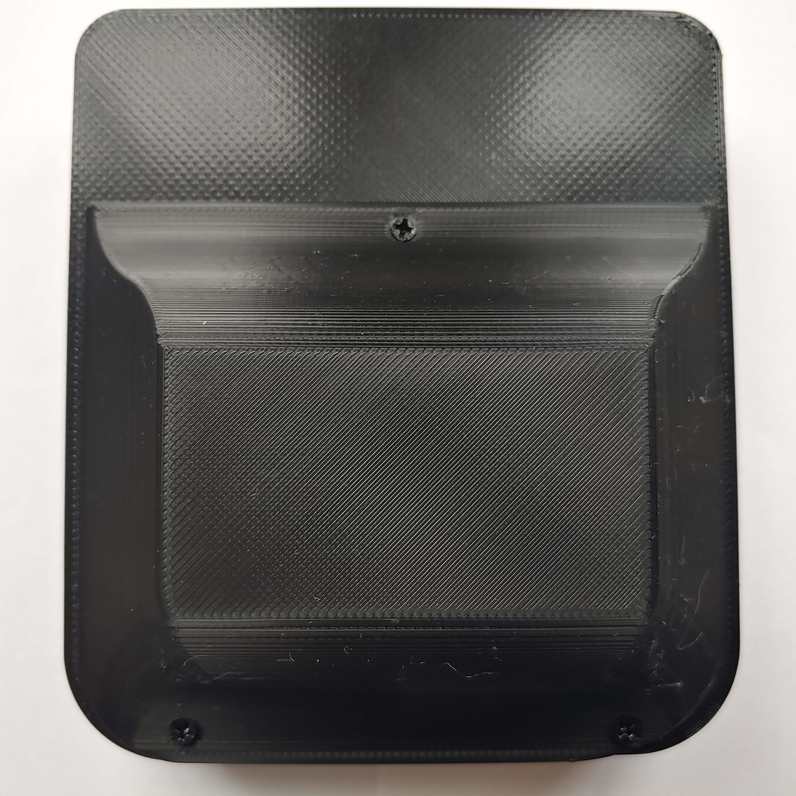

# Pico Handheld Games Console

## Table of Contents

* [Introduction](#introduction)
* [Brief](#brief)
* [Circuitry](#circuitry)
  + [Schematic](#schematic)
  + [PCB Design](#pcb-design)
  + [Display Pinout Jumpers](#display-pinout-jumpers)
  + [Soldered PCB](#soldered-pcb)
* [Board Manager & Programming Setup](#board-manager---programming-setup)
* [Code](#code)
* [Enclosure](#enclosure)
  + [CAD Renders](#cad-renders)
  + [3D Printed and Assembled](#3d-printed-and-assembled)
* [Game Library](#game-library)
* [Further Work](#further-work)

## Introduction

I started this project to follow on from my [ATtiny Handheld Games Console](https://github.com/SeanP2001/ATtiny_Handheld_Games_Console). I decided the project was not as accessible as I wanted because programming an ATtiny is not simple enough for a beginner. While the limitations of the ATtiny make it a fun challenge to create games, it would be nice to be able to make something more elaborate.

## Brief

I wanted to make a USB-programmable games console which could be programmed using either MicroPython or C++ (Arduino). I also wanted to use silicone button membranes to give the buttons a more premium feel compared to the tactile buttons on the ATtiny console. I also decided to make a version with a colour LCD display (see the ["LCD_Version"](https://github.com/SeanP2001/Pico_Handheld_Games_Console/tree/LCD_Version) branch).

## Circuitry

### Schematic

  

### PCB Design

|  |  |
| ------------------------------------ | ----------------------------------- |

### Display Pinout Jumpers

A feature of the PCB is the jumper connections under the display. The I2C OLED displays do not all have the same pin layout. When you buy a display online, the item you receive may not have the same pinout as the one in the photos. Due to this inconsistency, I designed the board to work with both pinouts. If your display has the pinout (in order) Vcc/GND/SCL/SDA then you need to use solder to bridge the middle pads to the upper pads (shown in blue below). If it is GND/Vcc/SCL/SDA then you need to bridge the middle pads to the lower pads (shown in red below). Once you have done this, use Kapton tape to insulate the solder bridges and prevent them from causing a short circuit on the back of the display.

|  |  |
| --------------------------------------------------- | ----------------------------------------------------------------- |

### Soldered PCB

 

## Board Manager & Programming Setup

To program the board in the Arduino IDE, I used the [arduino-pico](https://github.com/earlephilhower/arduino-pico) board manager. I installed this using the method shown in the arduino-pico repository.

For programming the Pico using MicroPython, I followed the fantastic [Official Raspberry Pi Foundation Documentation](https://projects.raspberrypi.org/en/projects/getting-started-with-the-pico). Before this project, I had never used MicroPython, and the information provided was very helpful.

## Code

This repository includes code to test that the buttons, buzzer and display are working correctly. There are two versions; one is an Arduino sketch, and the other is written in MicroPython. When you press a button, the buzzer will sound, and the display will show the name of the button pressed. Recognised buttons are as follows:

- UP
- DOWN
- LEFT
- RIGHT
- A
- B

## Enclosure

### CAD Renders

|  |  |
| --------------------------------------- | --------------------------------------- |

### 3D Printed and Assembled

|  |  |
| ------------------------------------------- | ------------------------------------------ |
|      |   |

## Game Library

Currently, there are no games for the Pico Handheld Games Console. If you make any games for this console, please do a "fork and pull request" to add a link to the repository for your game in this section.

## Further Work

This project has achieved its goal of being a more accessible, USB-programmable alternative to my [ATtiny Handheld Games Console](https://github.com/SeanP2001/ATtiny_Handheld_Games_Console).

In future, I would like to push this concept further to make a more advanced console with a larger, colour LCD. I am researching suitable LCDs which can be driven by the Pico (with a frame buffer). To follow the development of this version of the project, please see the ["LCD_Version"](https://github.com/SeanP2001/Pico_Handheld_Games_Console/tree/LCD_Version) branch.
